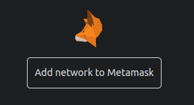

# ephemery
Guide to getting started with the Ethereum Ephemery Testnet quickly

https://ephemery.dev is the central repository for all things Ephemery

These notes draw heavily on documentation in [T-ess's guide based on geth and lodestar](https://github.com/ephemery-testnet/ephemery-scripts/blob/master/manual/setup-geth-lodestar.md).

## 0. Notes

This guide will become outdated VERY quickly! It's meant to capture a moment in time of Ephemery development, and unless it has been updated recently will be mostly useless after a month.

Everything in this guide is free for anyone to follow, including the software and Ephemery Ether. The only things that could incur an expense are the hardware and Internet connection. Virtual Private Servers (VPS) services often provide a server that you can use for around $6 a month.

## 1. Test machine setup

This demonstration is being done on an Ubuntu 22.04.5 (Jammy Jellyfish) Desktop installed on a VirtualBox Virtual machine.
- This is an **OLD** version of Ubuntu! It's okay! I had some difficulty with dependencies on 24.04.1. If the system asks you to upgrade to a new version of Ubuntu DON'T do it.
- The Desktop version of Ubuntu isn't generally recommended for running a validator, but it won't hurt and I'm using it to make copy/pasting easier when I create the video.
- I installed the VirtualBox Additions before starting this guide. It isn't necessary to do this, but you can.
- In order to install VirtualBox Additions, I also installed some pre-requisites: ```sudo apt install gcc make perl```

## 2. The big picture

Running an Ethereum validator requires two different pieces of software to work together, these are called the Execution client (historically called an "Eth1 client") and the Consensus client (the "Eth2 cleint). They work in concert, with the execution client managing transactions and the consensus client managing the chain. In order to have a validator running, we'll need both of these clients up and running, then we can deposit 32 [Ephemery]Ether to be a validator.

## 3. Execution Client

Because of a deep desire to develop [client diversity](https://clientdiversity.org) I strongly suggest that people use a different execution client, but because Ephemery is still in development, I'm using what's available.

### Install dependencies

```
sudo apt install golang-go curl git default-jre make gcc python3-distutils-extra python3-setuptools
```
```
curl -fsSL https://deb.nodesource.com/setup_20.x | sudo -E bash -
sudo apt install -y nodejs
```
```
sudo npm install --global yarn
```

### Download the Ephemery testnet configuration files

Download the `testnet-all.tar.gz` file for the [latest release of the Ephemery testnet](https://github.com/ephemery-testnet/ephemery-genesis/releases) to this directory using `wget`. Then unzip inside this folder. Note that the link in the example is likely to be outdated.

```
cd ~
mkdir testnet-all
cd testnet-all
wget https://github.com/ephemery-testnet/ephemery-genesis/releases/download/ephemery-138/testnet-all.tar.gz #this is likely to be an outdated resource
tar -xzf testnet-all.tar.gz
```

### Generate a jwt token to allow Eth1 and Eth2 clients to communicate.
The following command will generate a secret to ensure secure communication between the Execution Client and the Consensus client at `/tmp/jwtsecret`. Be mindful that using a jwt may require additional flags to be provided.

```
openssl rand -hex 32 | tr -d "\n" > "/tmp/jwtsecret"
```

### Download geth

```
cd ~
wget https://gethstore.blob.core.windows.net/builds/geth-linux-amd64-1.14.11-f3c696fa.tar.gz
tar xvf geth-linux-amd64-1.14.11-f3c696fa.tar.gz
sudo mv geth-linux-amd64-1.14.11-f3c696fa/geth /usr/local/bin/
rm -rf ~/geth-linux-amd64-1.14.11-f3c696fa*
```
### Initialize Geth with Ephemery settings

```
sudo mkdir /var/lib/geth
sudo chown -R $(whoami):$(whoami) /var/lib/geth
```
```
cd ~
sudo geth init --datadir "/var/lib/geth" ~/testnet-all/genesis.json
```
### Create a system service for geth

```
echo "[Unit]
Description=Geth Ethereum Node
After=network.target

[Service]
Type=simple
User=$(whoami)
ExecStart=/usr/local/bin/geth \\
--networkid 39438138 \\
--syncmode=full \\
--port 30303 \\
--http --datadir \"/var/lib/geth\" \\
--authrpc.jwtsecret=/tmp/jwtsecret \\
--bootnodes enode://50a54ecbd2175497640bcf46a25bbe9bb4fae51d7cc2a29ef4947a7ee17496cf39a699b7fe6b703ed0feb9dbaae7e44fc3827fcb7435ca9ac6de4daa4d983b3d@137.74.203.240:30303

Restart=on-failure

[Install]
WantedBy=multi-user.target" | sudo tee /etc/systemd/system/geth.service
```

### Enable and start the service

```
sudo systemctl daemon-reload
sudo systemctl enable geth.service
sudo systemctl start geth.service
sudo journalctl -f -u geth.service
```
(Press "Ctrl + C" to stop watching the log. Type "journalctl -f -u geth" to see it again.)

## 4. Consensus Client

Lodestar is a powerful consensus client developed in TypeScript. I gladly encourage using Lodestar on a production validator!

### Download and build Lodestar

```
cd ~
git clone https://github.com/chainsafe/lodestar.git
cd lodestar
yarn
yarn run build
```

### Create a system service for Lodestar

```
echo "[Unit]
Description=Lodestar Ethereum Consensus Client
After=network.target

[Service]
Type=simple
User=$(whoami)
WorkingDirectory=$HOME/lodestar
ExecStart=$HOME/lodestar/lodestar beacon \\
    --dataDir=\"$HOME/datadir-lodestar\" \\
    --network ephemery \\
    --paramsFile=\"$HOME/testnet-all/config.yaml\" \\
    --genesisStateFile=\"$HOME/testnet-all/genesis.ssz\" \\
    --checkpointSyncUrl=https://checkpointz.bordel.wtf \\
    --eth1.depositContractDeployBlock=0 \\
    --network.connectToDiscv5Bootnodes=true \\
    --discv5=true \\
    --eth1=true \\
    --eth1.providerUrls=http://localhost:8545 \\
    --execution.urls=http://localhost:8551 \\
    --bootnodes=enr:-LK4QLV1n8wq7htt9LRYGPJUGaC2-N-2IwwgCVofozWB2wy0PEbH14k7CpPh_jTTUQSoTD44-0NUeZQNnfuY9QJ2qpAEh2F0dG5ldHOIAAAAAAAAABiEZXRoMpCAPZkNUAAQG___________gmlkgnY0gmlwhIlKy_CJc2VjcDI1NmsxoQMJg9vL7g3u33NAckB6T4F_LUS2UE4C6XmPiINl3sUx7IN0Y3CCI4yDdWRwgiOM \\
    --jwt-secret=/tmp/jwtsecret \\
    --rest=true \\
    --rest.address=0.0.0.0 \\
    --rest.port=4000

Restart=on-failure

[Install]
WantedBy=multi-user.target" | sudo tee /etc/systemd/system/lodestar_beacon.service

```
### Enable and start the service

```
sudo systemctl daemon-reload
sudo systemctl enable lodestar_beacon.service
sudo systemctl start lodestar_beacon.service
sudo journalctl -f -u lodestar_beacon.service
```
(Press "Ctrl + C" to stop watching the log. Type "journalctl -f -u lodestar_beacon" to see it again.)

## 5. Set up MetaMask

Go to https://metamask.io and install metamask. 

Allow it to create a new seed phrase for you. Don't lose this! Because this is a testnet there's no risk of losing value, but you'll need the seed phrase later.

Go to https://ephemery.dev and click the top center link that says "Add network to Metamask". Authorize this addition on metamask.



## 6. Get Ephemery Ether

There are a few Ephemery faucets listed on https://ephemery.dev, but [this](https://ephemery-faucet.pk910.de/) is my favorite. You'll only need to mine 32.2 Ephemery Ether to proceed. Paste your Ethereum wallet address from Metamask.

https://ephemery-faucet.pk910.de/

## 7. Creating the validator keys and deposit data
```
cd ~/
wget https://github.com/eth-educators/ethstaker-deposit-cli/releases/download/v0.2.1/ethstaker_deposit-cli-66054f5-linux-amd64.tar.gz
tar xvf ethstaker_deposit-cli-66054f5-linux-amd64.tar.gz
cd ethstaker_deposit-cli-66054f5-linux-amd64/
./deposit existing-mnemonic
```

1. Press "Enter" to select English.

2. Enter the seed phrase you used when you set up metamask. (Use different seed phrases on mainnet, but we're aiming for simplicity here!)

3. This is a new seed phrase, so you'll enter "0" here.

4. Confirm the "0".

5. How many validators do you want to run? (I suggest starting with 1)

6. You must type the network name "ephemery".

7. Enter a twelce character password, 123456789012 works.

8. I suggest using your Metamask wallet address as your withdrawal address. (Note that if you're pasting into a terminal, CTRL + SHIFT + V works)

9. Confirm the same withdrawal address.


## 8. Import the validator keys

```
cd ~/lodestar
sudo ./lodestar validator import --importKeystores ~/ethstaker_deposit-cli-66054f5-linux-amd64/validator_keys --dataDir /var/lib/lodestar 
```

## 9. Create the validator service

```
echo "[Unit]
Description=Lodestar Ethereum Validator Client
After=network.target

[Service]
Type=simple
User=$(whoami)
WorkingDirectory=$HOME/lodestar
ExecStart=$HOME/lodestar/lodestar validator \\
    --network ephemery \\
    --dataDir \"/var/lib/lodestar\" \\
    --importKeystores \"$HOME/ethstaker_deposit-cli-66054f5-linux-amd64/validator_keys\" \\
    --importKeystoresPassword \"$HOME/password.txt\" \\
    --beaconNodes http://127.0.0.1:4000 \\
    --paramsFile=\"$HOME/testnet-all/config.yaml\" \\
    --graffiti=\"superphiz\" \\
    --suggestedFeeRecipient=\"0xeea9f77fdf2ef71365bd10eafe684cddb7de7d1f\"

Restart=on-failure

[Install]
WantedBy=multi-user.target" | sudo tee /etc/systemd/system/lodestar_validator.service
```

Fix a permission
```
sudo chown -R $(whoami):$(whoami) /var/lib/lodestar
```

### Enable and start the service

```
sudo systemctl daemon-reload
sudo systemctl enable lodestar_validator.service
sudo systemctl start lodestar_validator.service
sudo journalctl -f -u lodestar_validator.service
```
(Press "Ctrl + C" to stop watching the log. Type "journalctl -f -u lodestar_validator" to see it again.)

## 10. Make the deposit

Go to https://github.com/ephemery-testnet/ephemery-genesis

## 11. Monitoring progress

```journalctl -f``` (CTRL C to exit, this won't stop your services)
